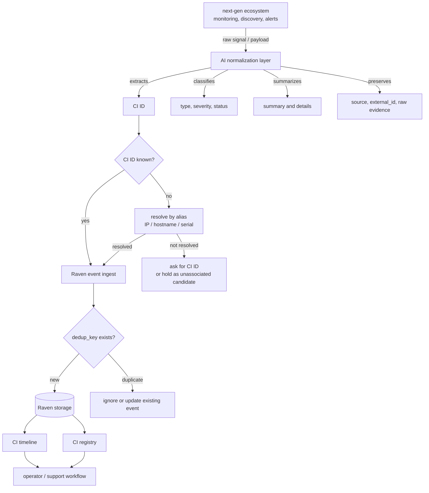

# Raven event ingest flow

Raven is the CMDB and operational timeline layer. It does not monitor the network directly. The `next-gen` ecosystem observes CI activity, an AI layer normalizes the signal, and Raven stores auditable events against stable CI IDs.

## Quick path

1. `next-gen` detects or receives a signal about a CI.
2. The AI layer extracts the CI ID, event type, severity, summary, and evidence.
3. Raven ingests the normalized event and deduplicates by source metadata.
4. Operators inspect the CI timeline in Raven.

## Current decision

| Topic | Decision |
| --- | --- |
| Raven role | CMDB + timeline memory, not a network monitor. |
| Primary identity | `ci_id` is mandatory for Raven records. |
| Categories | Required but flexible CMDB labels. |
| Event source | Preserve source metadata from `next-gen`. |
| AI role | Interpret and normalize; do not invent missing facts. |
| Evidence | Store source/external ID, dedup key, timestamps, and raw/reference data. |

## Flow diagram



## Event shape

```go
type Event struct {
    ID         string
    CIID       string
    Type       string
    Severity   string
    Status     string
    Summary    string
    Details    string
    Source     string
    ExternalID string
    DedupKey   string
    ObservedAt time.Time
    IngestedAt time.Time
    Raw        string
}
```

## CLI shape under consideration

Manual event entry:

```bash
raven event add RAVEN-DEV-001 \
  --type observation \
  --severity info \
  --summary "Initial Raven CI validated" \
  --source human
```

Normalized ingest from `next-gen` or an AI adapter can read either a JSON file or piped JSON from stdin:

```bash
raven event ingest --source next-gen --file alert.json

next-gen-export-alert | raven event ingest --source next-gen --stdin
```

Timeline inspection:

```bash
raven timeline RAVEN-DEV-001
```

## Rules for AI adapters

- Do not create or update Raven records without a CI ID unless an explicit unresolved-event flow exists.
- If the payload has IP, hostname, serial, or MAC but no CI ID, resolve through aliases before ingesting.
- Preserve source evidence. The summary is AI-generated; the source metadata is the audit trail.
- Use a stable `dedup_key`, preferably `<source>:<external_id>` when available.
- Do not treat category as a closed enum; Raven supports flexible CMDB categories.

## Current implementation status

Implemented Raven surfaces:

1. `Event` domain model.
2. JSON event storage at `~/.config/raven/events.json`.
3. CLI commands: `event add`, `event capture`, `event ingest`, and `timeline`.
4. `event ingest` accepts exactly one input source: `--file <json>` or `--stdin`.
5. Deduplication by `dedup_key` for structured ingest.

## Next step

Continue with one of:

1. Alias resolution for IP/hostname/serial/MAC to `ci_id` if `next-gen` cannot provide CI IDs directly.
2. `raven setup <agent>` automation for Gemini/Ollama/Codex/OpenCode instruction insertion.
3. SQLite storage once CIs, events, aliases, and ingest contracts stabilize.
